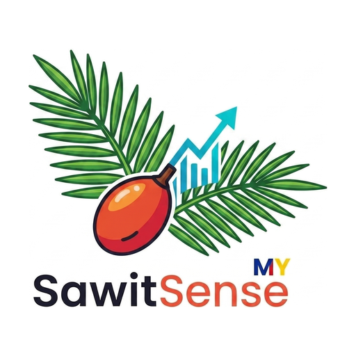

# SawitSense MY

<p align="center">
  
</p>

<p align="center">
  <strong>Sawit Kita, Harga Kita</strong> | Open-Source CPO Price Tracker & OER Signal
</p>

> **Current status (Sep 2026): indicative mode.** In May 2026 MPOB moved its Daily FFB Reference Price behind a licensee login. Until that price is available again, SawitSense shows **indicative** regional prices. They are derived from the MPOC daily CPO price and MPOB's monthly OER, and the app labels them as indicative. See [ADR-001](docs/ADR-001-mpob-data-source-change.md) and [PROJECT_STATUS.md](PROJECT_STATUS.md).

---

## What Is SawitSense?

SawitSense is an open-source, smallholder-first FFB (Fresh Fruit Bunch) price transparency tool for Malaysian oil palm farmers.

It solves a structural **information asymmetry** in the palm oil supply chain: the dealer knows the CPO price and assigns the OER grading — the smallholder usually doesn't see either before being quoted a price.

```
SMALLHOLDER (you)
       | sells FFB at dealer's quoted price
LICENSED DEALER
       | deducts transport, assigns OER, takes margin
PALM OIL MILL
       | processes at CPO market rate
MARKET PRICE (Bursa / MPOB)
```

**SawitSense puts the numbers in the smallholder's hand before they sell.**

---

## The Core Formula (Confirmed)

```
Price/mt = MPOB Price_1% x Graded_OER%
```

- **Price_1%** — MPOB publishes a Daily FFB Reference Price at 1% OER, broken down by 6 regions: North, South, Central, East Coast, Sabah, Sarawak
- **Graded_OER%** — The Oil Extraction Rate your dealer/mill assigns to your FFB (typically 17-22%)
- **Each 1% OER is worth ~RM 42+/tonne** — this is the hidden lever

Example: If the rate is RM 42.77/1% OER and your OER is 18%:
`RM 42.77 x 18 = RM 769.86/tonne`

> **Rejected Formula:** `CPO x 0.2? x 0.7?` — An unofficial shorthand circulating among dealers using unverifiable constants of unknown origin. Permanently excluded from SawitSense to protect data integrity.

---

## Feature Modules

### Phase 1 (Prototype) — Public Dashboard

| Module | Description | Status |
|--------|-------------|--------|
| **M1: Daily Price Dashboard** | Today's MPOB FFB Reference Price by region + CPO spot price (indicative since May 2026) | Done |
| **M2: Fair Price Calculator** | Input OER% + Region = benchmark price. Compare vs dealer quote. GREEN/AMBER/RED verdict. | Done |
| **M4: Price History** | 30-day CPO price line chart with fl_chart | Done |
| **Languages** | Bahasa Malaysia / English / 简体中文 menu | Done |
| **Feedback Button** | 3 preset options: helpful / confusing / wrong price | Done |

### Phase 2 (Production) — After Market Fit Confirmed

| Module | Description | Status |
|--------|-------------|--------|
| **M3: My Sales Journal** | Log each sale: date, weight, OER%, dealer, price. Local-first, cloud opt-in. | Planned |
| **M5: Dealer Transparency Map** | Anonymous crowdsourced dealer pricing by area. Deferred to last with anti-manipulation safeguards. | Planned |

---

## Tech Stack

| Layer | Technology | Rationale |
|-------|-----------|----------|
| Frontend | Flutter Web | Cross-platform, mobile-responsive |
| State Management | Riverpod | Scalable upgrade from Provider |
| Backend/Scraper | Python + GitHub Actions | Zero hosting cost |
| Data | JSON snapshots on GitHub Pages | Zero hosting cost |
| Charts | fl_chart | Interactive price visualization |
| Auth (Production) | Firebase Auth (Phone OTP) | Smallholders use phone numbers |
| Languages | BM + English + Chinese | Malaysian multicultural reality |
| Hosting | GitHub Pages | Free tier |

---

## Data Pipeline

```
MPOC Daily Palm Oil Prices (CPO)  +  MPOB Prestasi Sawit (monthly OER by state)
    -> scraper, twice every weekday (GitHub Actions)
    -> indicative Price_1% per region (ADR-001), labelled is_indicative
         |
    backend/data/*.json committed to main
         |
    deploy dispatched -> Flutter Web App (GitHub Pages)
         |
    freshness watchdog: alerts if the live site falls behind main
```

Before May 2026 the scraper read the Daily FFB Reference Price from MPOB BEPI directly. That source now requires a licensee login.

Every screen with prices shows a data freshness badge, as the ethical framework requires: GREEN (<6h) | AMBER (6-12h) | RED (>12h), with the age in words and the exact update time. When prices can't be loaded, the app says so. It never shows demo prices.

### Check the numbers yourself

Every figure SawitSense shows can be checked against a public page, or recalculated by hand:

| Figure | Where to check it |
|---|---|
| CPO settlement price | [MPOC Daily Palm Oil Prices](https://mpoc.org.my/daily-palm-oil-prices/) lists the same price for the same date |
| Regional OER | [MPOB Prestasi Sawit, OER Performance](https://prestasisawit.mpob.gov.my/en/oer). Choose the month shown in the app |
| Indicative price per 1% OER | By hand: CPO × 0.01 × 0.93. The method is in [ADR-001](docs/ADR-001-mpob-data-source-change.md) |
| Every price we've published | [backend/data/](backend/data/): open data, one JSON file per day, plus `history.json`, a 60-day index |

MPOB's official FFB Reference Price requires an MPOB licensee login, so it can't be linked publicly. That is why the app labels its regional prices as indicative. In the app, tap **How is this calculated?** to see the sum with today's figures.

---

## Project Structure

```
SawitSenseMY/
+-- backend/               # Python data pipeline
|   +-- scrapers/          # MPOC CPO, MPOB OER, legacy MPOB BEPI + core formula
|   +-- writer/            # JSON writer
|   +-- monitor/           # Health check + live-site freshness watchdog
|   +-- data/              # Published price snapshots (written by the scraper)
|   +-- tests/             # Unit tests
|   +-- run_scraper.py     # Pipeline orchestrator
|   +-- requirements.txt   # Python deps
+-- frontend/              # Flutter web app
+-- docs/                  # Architecture decision records (ADRs)
+-- .macp/                 # MACP v2.2: agents, handoffs, reasoning logs, ethics
+-- .github/workflows/     # Scraper, deploy, watchdog, CI
+-- AGENTS.md              # Agent instructions
+-- PROJECT_STATUS.md      # Current state — the project's single source of truth
+-- README.md              # This file
```

---

## Risk Register

| # | Risk | Severity | Mitigation | Phase |
|---|------|----------|------------|-------|
| R1 | MPOB scraper fragility | HIGH | Health monitor + Commodities-API fallback + freshness indicator | 1 |
| R2 | Rural connectivity | MEDIUM | Offline-first, cached prices with timestamp | 2 |
| R3 | Digital literacy | MEDIUM | Picture-based tutorial, WhatsApp share button | 2 |
| R4 | Dealer map manipulation | HIGH | Deferred to Phase 2 with: anomaly detection, rate limiting, account age, median not mean | 2 |
| R5 | Sybil attacks | HIGH | Device fingerprinting, 30-day account age, MPOB anchor display | 2 |
| R6 | Smallholder data privacy | MEDIUM | Local-first storage, cloud opt-in, user-scoped Firestore rules | 2 |

---

## Team (MACP v2.2)

| Agent | Role | Platform | Status |
|-------|------|----------|--------|
| **Alton** | Human Orchestrator, Founder, Smallholder (~5 acres) | Human | Always |
| **SS** | CTO & Lead Maintainer | Claude Code (Claude.ai in Phase 0) | Active, sole agent |
| **QQ** | CSO, Execution Lead (project originator) | Qoder | Inactive |
| **QQ (Perplexity)** | CSO, Active Executor (May 2026 recovery) | Perplexity Computer | Paused |

Authority: Alton > SS. Full registry: [.macp/agents.json](.macp/agents.json).

---

## Validation

| Run | Score | Verdict |
|-----|-------|---------|
| Trinity Run 1 (Full Platform) | 8.0/10 | PROCEED |
| Trinity Run 2 (Prototype-First) | 8.4/10 | STRONGLY PROCEED |
| CS Deep-Dive (v1.2 Calculator) | 8.5/10 | PROCEED, 0 vulnerabilities |

---

## Why This Matters

Indonesia and Malaysia together constitute 85% of the world's palm oil supply. In 2024, Malaysia's CPO average price hit RM 4,179.50/tonne, with total export earnings surging to RM 109.39 billion. There are **500,000+ smallholder farmers** who check CPO prices daily — yet there's no clean, open-source, mobile-friendly tool for them.

SawitSense fills that gap.

---

## License

MIT License. See [LICENSE](LICENSE).

**Sawit Kita, Harga Kita.**
